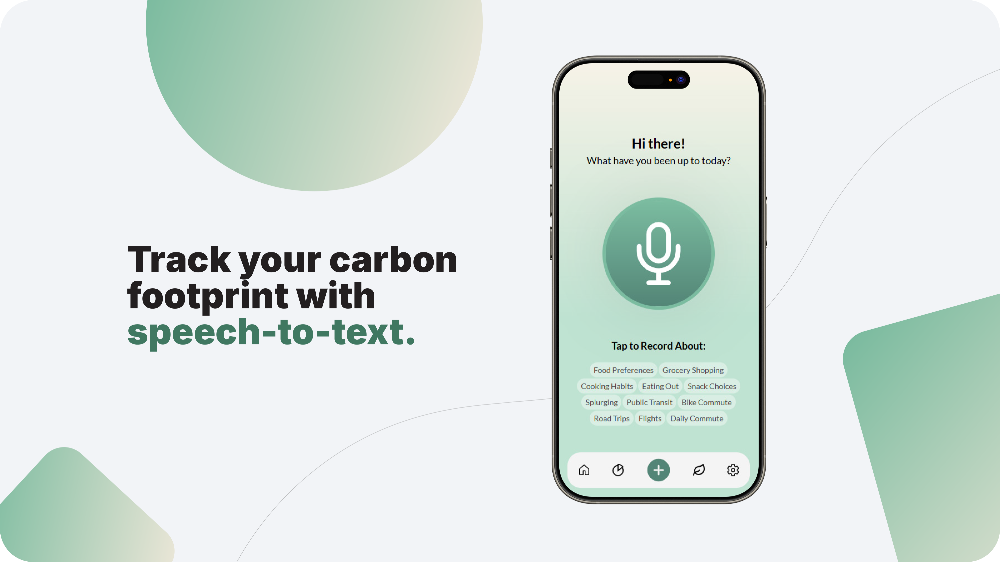
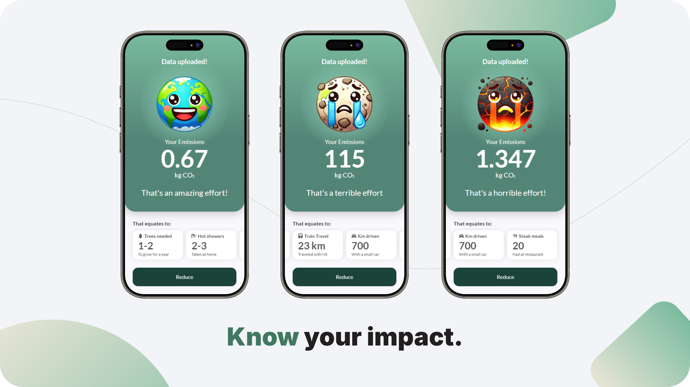
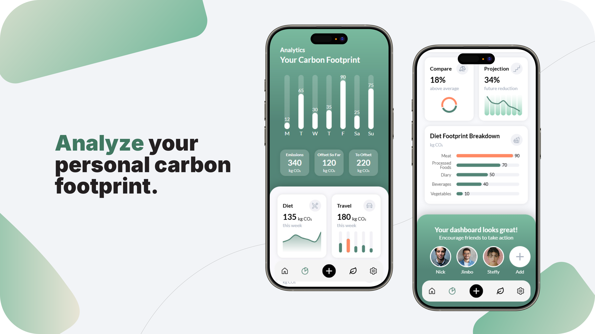
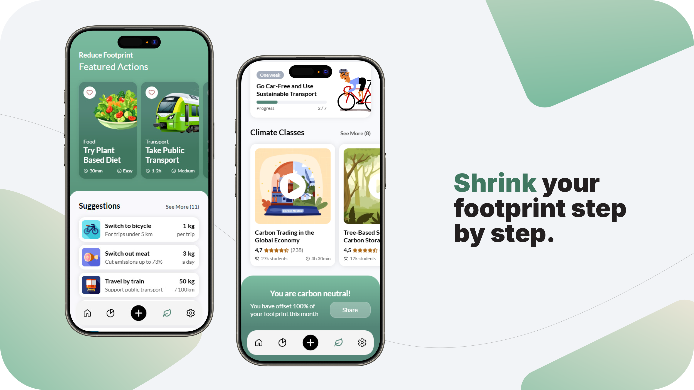

# 🌍 Carbon Footprint Tracker App (Front-End)


 


[](https://www.techlabs.org/location/rotterdam)

A mobile app that helps users track their daily carbon footprint using speech-to-text and AI — making sustainable living accessible one habit at a time. This project was built over 10-weeks during [**TechLabs**](https://www.techlabs.org/location/rotterdam) learning program. 

🚀 [**Front-End Live Demo**](https://carbon-footprint-tracker-app.netlify.app/)

Built with React and styled using TailwindCSS for rapid, responsive UI development. Data visualization is powered by Recharts, and smooth navigation is enabled by Swiper.js.


<p align="center">
  
</p>
<p align="center"><em>Image: Speech-to-text input screen</em></p>

## ✨ Features

- Track daily carbon footprint using **text and speech inputs**
- AI-assisted footprint estimation (via back-end API)
- Interactive Earth avatar reflects your eco performance (happy/sad states)
- Visualize habits with dynamic Recharts graphs
- Swiper.js sliders for smooth content navigation
- Built with a mobile-first layout for modern users
- Responsive and intuitive interface powered by React + Tailwind CSS


<p align="center">
   <p align="center">
      
   </p>  
   <p align="center">
      
      
      
      
      
      
   </p>
</p>
<p align="center"><em>AI-powered footprint results & Earth avatar reactions</em></p>

## 🔍 Development Decisions & Challenges

| Challenge                                         | Approach |
|---------------------------------------------------|---------------------------|
| Developing a mobile app with no native framework experience | Built prototype in **React** because of its reusable components. |
| Slow styling with plain CSS                       | Combined **Tailwind** with custom CSS for rapid UI development. |
| Displaying complex analytics data on small screens | Used **Recharts** for its wide chart variety, React component format, and high customizability. |
| Need for smooth touch-friendly UI navigation      | Chose **Swiper.js** for smooth, mobile-friendly sliders with easy customization. |
| No database for storing or fetching data          | Created **mock datasets** for analytics, avatars, and recommendations. |
| Blocky image loading                              | Tested **preloading**, but further optimization is needed. |
| Maintaining consistent code style                 | Used **Prettier** for automated formatting. |


## 🗂️ App Structure

<details>
  <summary>Expand the project directory layout</summary>

```bash
src/
├── App.js              # Main app component with routing logic
├── components/         # Reusable UI components
│   └── NavBar.js       # Bottom navigation bar
├── pages/              # Main application pages
│   ├── home page/      # Dashboard with Earth avatar
│   ├── analytics page/ # Data visualization and charts
│   ├── input page/     # Speech-to-text input forms
│   ├── reduce page/    # Tips for reducing carbon footprint
│   └── settings page/  # App configuration
├── context/            # React Context for state management
│   └── pages.js        # Global state provider
└── styles/             # CSS files and design variables
```
</details>


## 👨‍💻 My Role & Takeaways – UI Designer & Front-End Developer

- Prototyped the app with **low-fidelity wireframes** in [Figma](https://www.figma.com/design/DOi1GQXIGjJzYai86D1mMY/Carbon-Footprint-App?node-id=177-1077&t=VRWisJnakS3HhSOG-1) 
- Developed responsive UI using React and Tailwind CSS
- Integrated third-party libraries like Recharts (data viz) and Swiper.js (UX) 
- Created all mock data and content to define app structure and flow
- Learned the importance of MVP for scope management
- Strengthened remote teamwork and cross-role communication skills


<p align="center">
  
</p>
<p align="center"><em>Low-fidelity wireframes created in Figma</em></p>

## 👥 Team

- 🧑 [Reinis Pakulis](https://nl.linkedin.com/in/reinis-pakulis) – UI Designer & Front-End Developer *(you’re here!)*
- 👩‍💻 Maaike Wachters – AI, Speech-to-Text, API Integration  
- 👩‍💻 Mila Levchenko – Prompt Engineering, Footprint Calculation Logic  
- 🎨 Natascha Smit – UX/UI Designer  

**Mentors**  
- Jeremy Stryker – UX/UI  
- Pascal Muller – AI


<p align="center">
      
      
   </p>
<p align="center"><em>Footprint analytics & AI-powered reduction tips</em></p>

## 🚀 Future Work  

- Make layout fully responsive (beyond mobile)
- Polish animations and transitions
- Improve component structure for scalability
- Fix slow image loading and optimize overall performance
- Integrate backend APIs for dynamic, real-time data
- Develop Settings page and user account features


## ⚙️ Running Locally

<details>
  <summary>Instructions</summary>

  <p>

  To run this project locally:

  <pre><code>git clone https://github.com/WorkReinis/carbon-footprint-tracker-app.git
cd carbon-footprint-tracker-app
npm install
npm start</code></pre>

  Open <a href="http://localhost:3000" target="_blank">http://localhost:3000</a> in your browser.

  <em>Currently uses static data; <a href="https://inspiring-semifreddo-7615dd.netlify.app/" target="_blank">Back-End</a> integration planned.</em>

  </p>
</details>

## 📄 License

This project is for educational purposes.  
Feel free to fork and experiment with it!


